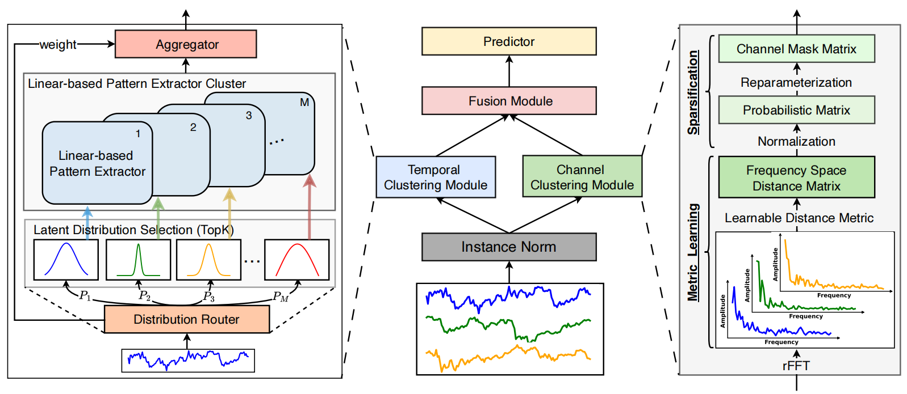
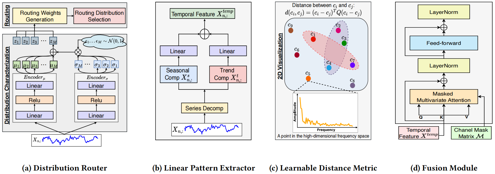
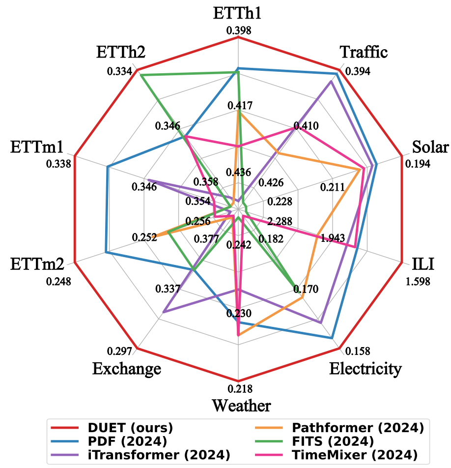
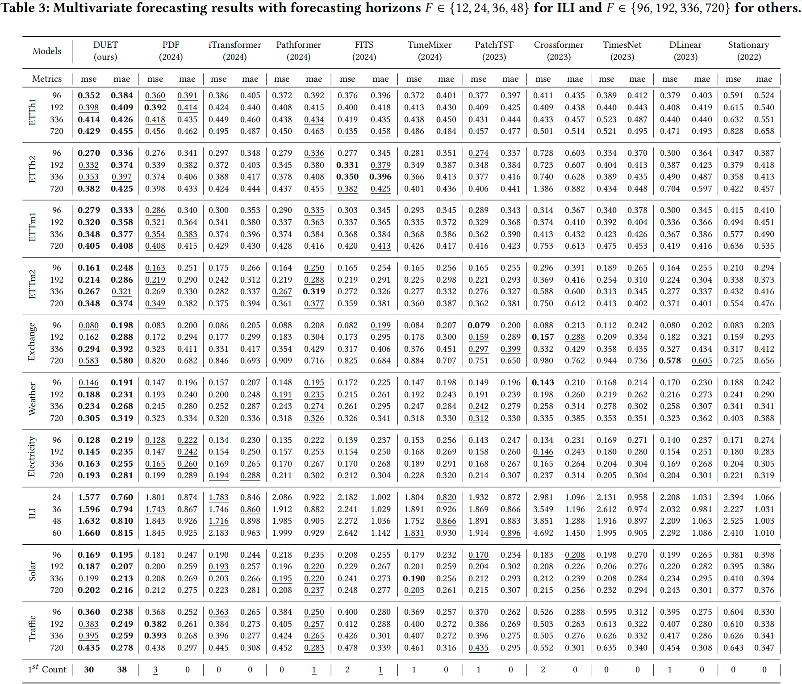

#  DUET: Dual Clustering Enhanced Multivariate Time Series Forecasting

[](https://arxiv.org/pdf/2412.10859)  [](https://www.python.org/)  [](https://pytorch.org/)    [](https://badges.pufler.dev/visits/decisionintelligence/DUET)

This code is the official PyTorch implementation of our KDD'25 paper: [DUET](https://arxiv.org/pdf/2412.10859): Dual Clustering Enhanced Multivariate Time Series Forecasting.

If you find this project helpful, please don't forget to give it a ⭐ Star to show your support. Thank you!

🚩 News (2024.12) DUET has been included in the time series forecasting benchmark [TFB](https://github.com/decisionintelligence/TFB) and the time series analytics leaderboard [OpenTS](https://decisionintelligence.github.io/OpenTS/).

🚩 News (2024.11) DUET has been accepted by SIGKDD 2025.


## Introduction

**DUET**,  which introduces a <ins>**DU**</ins>al clustering on the temporal and channel dimensions to <ins>**E**</ins>nhance multivariate <ins>**T**</ins>ime series forecasting. Specifically, it clusters sub-series into fine-grained distributions with the **TCM** to better model the heterogeneity of temporal patterns. It also utilizes a Channel-Soft-Clustering strategy and captures the relationships among channels with the **CCM**. Euipped with the dual clustering mechanism, DUET rationally harnesses the spectrum of information from both the temporal and channel dimensions, thus forecasting more accruately.  

<div align="center">

</div>

The important components of DUET: (a) Distribution Router; (b) Linear Pattern Extractor; (c) Learnable Distance Metric; (d) Fusion Module.
<div align="center">

</div>


## Quickstart

1. Requirements

Given a python environment (**note**: this project is fully tested under python 3.8), install the dependencies with the following command:

```shell
pip install -r requirements.txt
```

2. Data preparation

You can obtained the well pre-processed datasets from [Google Drive](https://drive.google.com/file/d/1vgpOmAygokoUt235piWKUjfwao6KwLv7/view?usp=drive_link). Then place the downloaded data under the folder `./dataset`. 

3. Train and evaluate model

- To see the model structure of DUET,  [click here](./ts_benchmark/baselines/duet/models/duet_model.py).
- We provide all the experiment scripts for DUET and other baselines under the folder `./scripts/multivariate_forecast`.  For example you can reproduce all the experiment results as the following script:

```shell
sh ./scripts/multivariate_forecast/ETTh1_script/DUET.sh
```


## Results
We utilize the Time Series Forecasting Benchmark ([TFB](https://github.com/decisionintelligence/TFB)) code repository as a unified evaluation framework, providing access to **all baseline codes, scripts, and results**. Following the settings in TFB, we do not apply the **"Drop Last"** trick to ensure a fair comparison.

Extensive experiments on  25 real-world datasets from 10 different application domains, demonstrate that DUET achieves state-of-the-art~(SOTA) performance. We show the main results of the 10 commonly-used datasets below, click [here](./figures/other_results.jpg) to see the results for the remaining 15 datasets:

<div align="center">

</div>


<div align="center">

</div>

## FAQ

1. How to use Pycharm to run code？

When running under pycharm，please escape the double quotes, remove the spaces, and remove the single quotes at the beginning and end.

Such as: **'{"d_ff": 512, "d_model": 256, "horizon": 24}' ---> {\\"d_ff\\":512,\\"d_model\\":256,\\"horizon\\":24}**

```shell
--config-path "rolling_forecast_config.json" --data-name-list "ILI.csv" --strategy-args {\"horizon\":24} --model-name "duet.DUET" --model-hyper-params {\"batch_size\":8,\"dropout\":0.15,\"fc_dropout\":0,\"d_ff\":1024,\"d_model\":128,\"n_heads\":1,\"e_layers\":2,\"lr\":0.0005,\"horizon\":24,\"seq_len\":104,\"factor\":3,\"lradj\":\"type1\",\"loss\":\"MAE\",\"num_experts\":2,\"k\":2,\"patch_len\":48,\"patience\":5,\"num_epochs\":100,\"CI\":1} --gpus 0 --num-workers 1 --timeout 60000 --save-path "ILI/DUET"
```

## Citation

If you find this repo useful, please cite our paper.

```
@inproceedings{qiu2025duet,
 title     = {DUET: Dual Clustering Enhanced Multivariate Time Series Forecasting},
 author    = {Xiangfei Qiu and Xingjian Wu and Yan Lin and Chenjuan Guo and Jilin Hu and Bin Yang},
 booktitle = {SIGKDD},
 year      = {2025}
}

@article{qiu2024tfb,
 title   = {TFB: Towards Comprehensive and Fair Benchmarking of Time Series Forecasting Methods},
 author  = {Xiangfei Qiu and Jilin Hu and Lekui Zhou and Xingjian Wu and Junyang Du and Buang Zhang and Chenjuan Guo and Aoying Zhou and Christian S. Jensen and Zhenli Sheng and Bin Yang},
 journal = {Proc. {VLDB} Endow.},
 volume  = {17},
 number  = {9},
 pages   = {2363--2377},
 year    = {2024}
}
```

## Contact

If you have any questions or suggestions, feel free to contact:

- [Xiangfei Qiu](https://qiu69.github.io/) (xfqiu@stu.ecnu.edu.cn)
- Xingjian Wu (xjwu@stu.ecnu.edu.cn)


Or describe it in Issues.

