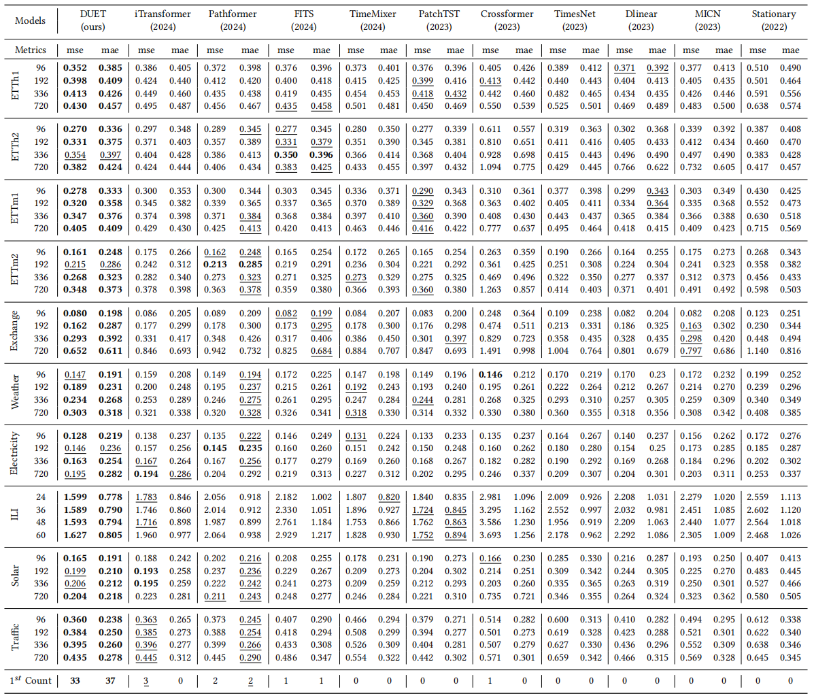

#  DUET: Dual Clustering Enhanced Multivariate Time Series Forecasting

**This code is a PyTorch implementation of DUET.**

🚩 News (2024.12) DUET has been included in the time series forecasting benchmark [TFB](https://github.com/decisionintelligence/TFB) and the time series analytics leaderboard [OpenTS](https://decisionintelligence.github.io/OpenTS/).


## Introduction

**DUET**,  which introduces a <ins>**DU**</ins>al clustering on the temporal and channel dimensions to <ins>**E**</ins>nhance multivariate <ins>**T**</ins>ime series forecasting. Specifically, it clusters sub-series into fine-grained distributions with the **TCM** to better model the heterogeneity of temporal patterns. It also utilizes a Channel-Soft-Clustering strategy and captures the relationships among channels with the **CCM**. Euipped with the dual clustering mechanism, DUET rationally harnesses the spectrum of information from both the temporal and channel dimensions, thus forecasting more accruately.  

<div align="center">

</div>

The important components of DUET: (a) Distribution Router; (b) Linear Pattern Extractor; (c) Learnable Distance Metric; (d) Fusion Module.
<div align="center">

</div>


## Quickstart

### Requirements

Given a python environment (**note**: this project is fully tested under python 3.8), install the dependencies with the following command:

```shell
pip install -r requirements.txt
```

### Data preparation

You can obtained the well pre-processed datasets from [Google Drive](https://drive.google.com/file/d/1vgpOmAygokoUt235piWKUjfwao6KwLv7/view?usp=drive_link). Then place the downloaded data under the folder `./dataset`. 

### Train and evaluate model

- To see the model structure of DUET,  [click here](./ts_benchmark/baselines/duet/models/duet_model.py).
- We provide all the experiment scripts for DUET and other baselines under the folder `./scripts/multivariate_forecast`.  For example you can reproduce all the experiment results as the following script:

```shell
sh ./scripts/multivariate_forecast/ETTh1_script/DUET.sh
```


## Results

Extensive experiments on  25 real-world datasets from 10 different application domains, demonstrate that DUET achieves state-of-the-art~(SOTA) performance. We show the main results of the 10 commonly-used datasets:

<div align="center">

</div>


<div align="center">

</div>


## Contact

If you have any questions or suggestions, feel free to contact:

- Xiangfei Qiu (xfqiu@stu.ecnu.edu.cn)
- Xingjian Wu (xjwu@stu.ecnu.edu.cn)


Or describe it in Issues.

